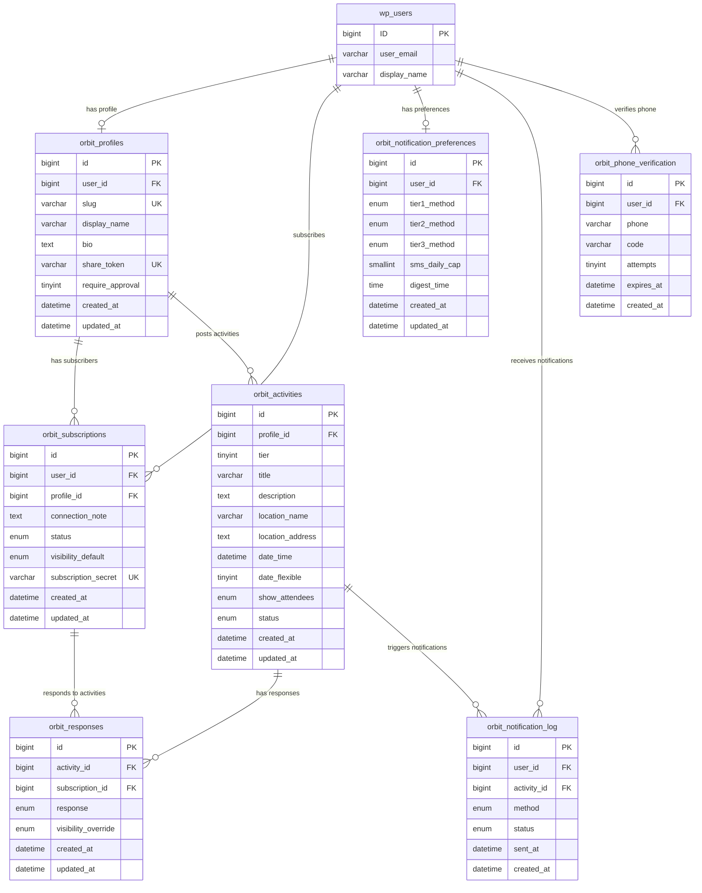

# Build Orbit v1 WordPress Plugin

## Overview

Build the Orbit plugin from scratch — the data layer, business logic, REST API, WP-CLI commands, and notification system for a person-centric social activity tool. The plugin owns all data and logic; the companion FSE theme (separate repo) handles rendering.

Orbit lets a **poster** share a link with people they know. Those people **subscribe** and get notified when the poster broadcasts activities at varying commitment tiers (just an idea / I'll go if you will / I'm going). Subscribers respond with lightweight going/maybe actions. No app required — web + SMS + email.

Full spec: `docs/refs/orbit-v1-spec.md`

## Problem Statement / Motivation

This is a greenfield build. No existing code. The spec is comprehensive and locked — the job is to implement it faithfully with clean WordPress patterns.

## Proposed Solution

Build the plugin in phases, starting with the data foundation and progressively adding business logic, API surface, and integrations. Each phase produces working, testable code.

## Technical Approach

### Architecture

```
orbit/
├── orbit.php                              # Plugin header, bootstrap, activation/deactivation hooks
├── includes/
│   ├── class-orbit-activator.php          # Table creation (dbDelta), role setup, page creation
│   ├── class-orbit-roles.php              # Role and capability registration
│   ├── class-orbit-profile.php            # Profile CRUD
│   ├── class-orbit-activity.php           # Activity CRUD
│   ├── class-orbit-subscription.php       # Subscription management
│   ├── class-orbit-response.php           # Response handling
│   ├── class-orbit-notifier.php           # Notification dispatch (SMS, email, digest)
│   ├── class-orbit-twilio.php             # Twilio API wrapper (wp_remote_post)
│   ├── class-orbit-phone-verify.php       # Phone verification flow
│   ├── class-orbit-privacy.php            # Visibility resolution logic
│   ├── class-orbit-token.php              # Token generation and validation (share, action, subscription)
│   └── class-orbit-rest-api.php           # REST API endpoint registration
├── cli/
│   ├── class-orbit-cli.php                # WP-CLI registration and base command
│   ├── class-orbit-cli-profile.php        # wp orbit profile [create|get|update|delete|list|regenerate-token]
│   ├── class-orbit-cli-activity.php       # wp orbit activity [create|get|update|cancel|list|responses]
│   ├── class-orbit-cli-subscription.php   # wp orbit subscription [list|approve|deny|remove]
│   ├── class-orbit-cli-subscriber.php     # wp orbit subscriber [list|get|set-role|set-preferences|subscriptions]
│   ├── class-orbit-cli-response.php       # wp orbit response [set|remove|list]
│   ├── class-orbit-cli-notification.php   # wp orbit notification [send-digest|preview-digest|log]
│   └── class-orbit-cli-status.php         # wp orbit status — system overview
├── composer.json                          # ActionScheduler dependency
└── readme.txt
```

Key architectural decisions from the spec:
- **Custom tables** (not CPTs) for all data — `orbit_profiles`, `orbit_activities`, `orbit_subscriptions`, `orbit_responses`, `orbit_notification_preferences`, `orbit_notification_log`, `orbit_phone_verification`
- **Tier and status as columns**, not taxonomies — they're constrained enums that drive application logic
- **ActionScheduler** for async jobs (digest sending, past-activity marking, log cleanup)
- **Twilio via `wp_remote_post()`** — no SDK dependency
- **All datetimes stored in UTC**
- **Shortcodes** (not blocks) for dynamic content insertion in FSE templates
- **Plugin never outputs HTML directly** except within shortcode callbacks

### Implementation Phases

#### Phase 1: Plugin Foundation

Scaffold the plugin, create tables, register roles.

**Files:**

- `orbit.php` — plugin header, constants, autoloading, activation/deactivation hooks
- `includes/class-orbit-activator.php` — `dbDelta()` for all 7 custom tables, create WordPress pages (dashboard, manage, etc.), flush rewrite rules
- `includes/class-orbit-roles.php` — register `orbit_subscriber` and `orbit_poster` roles with capabilities
- `composer.json` — require `woocommerce/action-scheduler`

**Tasks:**

- [x] `orbit.php`: Plugin header, version constant, table name constants, register activation/deactivation hooks, autoload includes
- [x] `class-orbit-activator.php`: `dbDelta()` schemas for all 7 tables with proper charset/collation, WordPress page creation for authenticated routes, `flush_rewrite_rules()`
- [x] `class-orbit-roles.php`: Register roles (`orbit_subscriber`, `orbit_poster`) and capabilities, add role on activation, handle role upgrade (subscriber → poster adds role, doesn't replace)
- [x] `composer.json`: Require ActionScheduler, configure autoloading
- [ ] Verify: activate plugin, confirm tables exist, confirm roles exist

**Success criteria:**
- Plugin activates without errors
- All 7 tables created with correct schemas
- Roles and capabilities registered
- WordPress pages created for authenticated routes

#### Phase 2: Core Data Layer — Profiles & Activities

CRUD classes for the two primary entities.

**Files:**

- `includes/class-orbit-profile.php`
- `includes/class-orbit-activity.php`
- `includes/class-orbit-token.php`

**Tasks:**

- [x] `class-orbit-token.php`: Token generation (`wp_generate_password(32, false)` for share tokens and subscription secrets), HMAC-SHA256 action token generation/validation (input: subscription_secret + activity_id + expiry), expiry logic (7 days after activity date, 30 days for dateless)
- [x] `class-orbit-profile.php`: Create (with slug uniqueness check, share_token generation), get (by ID, by slug, by user_id), update, delete (soft: deactivate + notify subscribers), list (with filters), `regenerate_token()`
- [x] `class-orbit-activity.php`: Create (validates tier 1-3, optional date/time, defaults for show_attendees/status), get, update, cancel (sets status=cancelled), list (filter by profile, status, tier, date range), mark past (batch update where date_time < now and status = active)
- [x] Input validation: slug via `sanitize_title()` + reserved slug check (`dashboard`, `manage`, `activity`, `unsubscribe`, `api`, `wp-admin`), title via `sanitize_text_field()` max 300 chars, bio via `sanitize_textarea_field()`

**Success criteria:**
- Profiles can be created, read, updated, soft-deleted
- Activities can be created at all 3 tiers, listed with filters, cancelled
- Slugs are validated and unique
- Share tokens are generated and regeneratable

#### Phase 3: Subscriptions & Responses

The relationship layer — who subscribes to whom, who's going to what.

**Files:**

- `includes/class-orbit-subscription.php`
- `includes/class-orbit-response.php`
- `includes/class-orbit-privacy.php`

**Tasks:**

- [x] `class-orbit-subscription.php`: Subscribe (create with status based on poster's `require_approval`), approve/deny/remove (status transitions), list (by profile with status filter, by user), unsubscribe (sets status=unsubscribed), unique constraint enforcement (user_id + profile_id), `subscription_secret` generation on creation, prevent duplicate subscriptions
- [x] `class-orbit-response.php`: Set response (upsert — going/maybe, with unique constraint on activity_id + subscription_id), remove response, list by activity (with visibility resolution), list by user, validate that subscription is approved before allowing response
- [x] `class-orbit-privacy.php`: Visibility resolution — given an activity and a list of responses, resolve what the viewer sees based on: (1) poster's `show_attendees` setting → none/count/names, (2) each responder's effective visibility (per-activity override > account default). Location address: only show to approved subscribers (check via session or valid action token)

**Success criteria:**
- Subscription lifecycle works: pending → approved → unsubscribed
- Responses are idempotent (set twice = update, not duplicate)
- Privacy resolution correctly cascades poster settings → subscriber settings
- Location address hidden from non-subscribers

#### Phase 4: Notification System

The most complex subsystem — SMS, email, digest batching, ActionScheduler integration.

**Files:**

- `includes/class-orbit-notifier.php`
- `includes/class-orbit-twilio.php`
- `includes/class-orbit-phone-verify.php`

**Tasks:**

- [x] `class-orbit-notifier.php`:
  - `dispatch_for_activity($activity_id)` — for each approved subscriber: check tier preference, check SMS daily cap (count today's SMS from `orbit_notification_log`), route to immediate or digest accordingly, log to `orbit_notification_log` with status=queued
  - `send_immediate_sms($user_id, $activity_id, $action_token)` — format SMS per spec template, call Twilio, update log status
  - `send_immediate_email($user_id, $activity_id, $action_token)` — format email (HTML + plain text), use `wp_mail()`, update log status
  - `compile_digest($user_id)` — query activities since last digest, group by poster, sort by tier desc then date, include SMS-overflow items, generate action tokens per activity
  - `send_digest($user_id)` — compile + send via `wp_mail()`, skip if nothing new
  - SMS cap prompt logic: if user received >3 SMS today and has no cap set, flag for dashboard prompt
- [x] `class-orbit-twilio.php`:
  - `send_sms($to, $body)` — `wp_remote_post()` to Twilio REST API using `ORBIT_TWILIO_*` constants
  - `validate_webhook($request)` — verify Twilio request signature on incoming webhooks
  - `handle_incoming($request)` — process STOP/START keywords, update user preferences
- [x] `class-orbit-phone-verify.php`:
  - `send_code($user_id, $phone)` — generate 6-digit code, store in `orbit_phone_verification` with expiry (10 min), rate limit (3 requests/phone/hour), send via Twilio
  - `verify_code($user_id, $code)` — check code, check attempts (max 3), check expiry, on success set `orbit_phone_verified=1`
  - `reset_on_phone_change($user_id)` — clear verification when phone number changes
- [x] ActionScheduler job registration:
  - `orbit_send_immediate_notification` — one-off, queued on activity creation
  - `orbit_send_daily_digest` — recurring per-user, scheduled at their `digest_time` in their timezone
  - `orbit_mark_past_activities` — recurring daily, batch update past activities
  - `orbit_cleanup_notification_log` — recurring weekly, prune old entries
- [x] `orbit_notification_preferences` — created per-user with defaults on first subscription (tier1=digest, tier2=digest, tier3=sms, digest_time=18:00)

**Success criteria:**
- Activity creation triggers correct notification routing per subscriber preferences
- SMS daily cap correctly overflows to digest
- Digest compiles correct activities grouped/sorted per spec
- Phone verification flow works with rate limiting and expiry
- ActionScheduler jobs registered and fire correctly
- Twilio webhook validates signatures and handles STOP/START

#### Phase 5: REST API

Full REST API surface under `/wp-json/orbit/v1/`.

**File:**

- `includes/class-orbit-rest-api.php`

**Tasks:**

- [ ] Public endpoints (no auth):
  - `POST /subscribe` — subscription request with valid share_token, account creation or existing user subscription
  - `POST /unsubscribe` — via subscription_secret, no login required
  - `POST /respond` — via action token (validates HMAC, checks expiry) OR logged-in user
  - `POST /twilio/incoming` — Twilio webhook handler with signature validation
- [ ] Authenticated endpoints:
  - `POST /verify-phone` — submit verification code (logged-in or token)
  - `GET /activities` — list activities for a profile (logged-in subscriber)
  - `POST /activities` — create activity (orbit_poster)
  - `PATCH /activities/{id}` — update activity (poster/owner)
  - `DELETE /activities/{id}` — cancel activity (poster/owner)
  - `GET /activities/{id}/responses` — list responses (poster/owner)
  - `GET /subscriptions` — list current user's subscriptions
  - `GET /subscribers` — list subscribers for poster's profile (orbit_poster)
  - `PATCH /subscribers/{id}` — approve/deny/remove (poster/owner)
  - `PATCH /preferences` — update notification preferences
  - `DELETE /respond` — remove response (logged-in subscriber)
- [ ] Admin endpoints:
  - `GET /profiles`, `POST /profiles`, `PATCH /profiles/{id}`, `DELETE /profiles/{id}` — profile CRUD
  - `POST /profiles/{id}/regenerate-token` — regenerate share token
  - `GET /status` — system status summary
  - `GET /notifications` — notification log (filtered)
- [ ] All endpoints: proper permission callbacks, input sanitization, nonce verification for logged-in actions, schema validation, WP_Error responses

**Success criteria:**
- All endpoints from capability map are implemented
- Permission checks enforce role/ownership correctly
- Public endpoints validate tokens correctly
- Response format is consistent JSON with proper HTTP status codes

#### Phase 6: WP-CLI Commands

Full CLI parity for agent-native access.

**Files:**

- `cli/class-orbit-cli.php`
- `cli/class-orbit-cli-profile.php`
- `cli/class-orbit-cli-activity.php`
- `cli/class-orbit-cli-subscription.php`
- `cli/class-orbit-cli-subscriber.php`
- `cli/class-orbit-cli-response.php`
- `cli/class-orbit-cli-notification.php`
- `cli/class-orbit-cli-status.php`

**Tasks:**

- [ ] `class-orbit-cli.php`: Register `orbit` namespace, base command class
- [ ] `class-orbit-cli-profile.php`: `create`, `get` (by ID or slug), `update`, `delete` (with --force for hard delete), `list`, `regenerate-token`
- [ ] `class-orbit-cli-activity.php`: `create` (queues notifications), `get`, `update`, `cancel`, `list` (with --profile, --status, --tier, --after, --before filters), `responses`
- [ ] `class-orbit-cli-subscription.php`: `list` (with --profile, --status filters), `approve`, `deny`, `remove`, bulk approve (--all --status=pending)
- [ ] `class-orbit-cli-subscriber.php`: `subscriptions` (list user's subscriptions), `get`, `set-preferences`, `set-role`
- [ ] `class-orbit-cli-response.php`: `set` (idempotent create/update), `remove`, `list` (by user)
- [ ] `class-orbit-cli-notification.php`: `send-digest` (manual trigger for user), `preview-digest` (dry run), `log` (with --user, --method, --status, --after filters)
- [ ] `class-orbit-cli-status.php`: System overview — counts, config state, recent activity, Twilio/SMTP status
- [ ] All commands: `--format=json|csv|table` support, JSON output on mutations, exit code 0/1, errors to STDERR

**Success criteria:**
- Full parity with capability map from spec
- `wp orbit status --format=json` returns expected structure
- All list commands support filtering
- Mutating commands output affected record as JSON

#### Phase 7: Routes, Rewrites & Shortcodes

Custom URL routing and shortcodes for the theme to consume.

**Tasks:**

- [ ] Custom rewrite rules:
  - `/@{slug}` → profile page (query var: `orbit_profile_slug`)
  - `/@{slug}/subscribe` → subscription form (query var: `orbit_subscribe`)
  - `/activity/{id}` → activity detail (query var: `orbit_activity_id`)
  - `/unsubscribe` → unsubscribe handler (query var: `orbit_unsubscribe`)
- [ ] Shortcode registration:
  - `[orbit_dashboard]` — subscriber's unified view
  - `[orbit_settings]` — notification preferences, visibility, timezone
  - `[orbit_manage]` — poster's management view
  - `[orbit_new_activity]` — create activity form
  - `[orbit_edit_activity]` — edit activity form
  - `[orbit_subscribers]` — manage subscriber list
  - `[orbit_edit_profile]` — edit poster profile
  - `[orbit_profile]` — public poster profile page
  - `[orbit_subscribe_form]` — subscription signup form
  - `[orbit_activity]` — activity detail page
- [ ] Template redirects: `front-page.html` logic (logged out → landing, logged in → dashboard redirect)
- [ ] `robots.txt` additions: block `/activity/`, `/dashboard/`, `/manage/`
- [ ] `<meta name="robots" content="noindex, nofollow">` on activity and authenticated pages
- [ ] Access control in shortcode callbacks: check roles, redirect unauthorized users

**Success criteria:**
- `/@sarah-k` resolves to the correct profile
- `/@sarah-k/subscribe?token=abc123` shows subscription form
- `/activity/123?act=ACTION_TOKEN` works without login
- `/unsubscribe?token=xyz` works without login
- All shortcodes render appropriate content based on user role/auth state

#### Phase 8: Security & Rate Limiting

Harden the plugin.

**Tasks:**

- [ ] Input validation (verify all entry points):
  - Phone numbers: E.164 format validation and normalization
  - Email: `is_email()`
  - Profile slugs: `sanitize_title()` + uniqueness + reserved slug list
  - Connection notes: `sanitize_textarea_field()`, max 500 chars
  - Activity titles: `sanitize_text_field()`, max 300 chars
  - All user input: appropriate WordPress sanitization functions
- [ ] Nonce verification on all logged-in form submissions
- [ ] Rate limiting via transients:
  - Subscription form: 5/hour/IP (`ORBIT_RATE_LIMIT_SUBSCRIBE`)
  - Phone verification: 3 requests/phone/hour
  - Basic rate limiting on unauthenticated API endpoints
- [ ] Token security:
  - Share tokens: `wp_generate_password(32, false)`, regeneratable
  - Subscription secrets: `wp_generate_password(32, false)`, stable per subscription
  - Action tokens: HMAC-SHA256, activity-scoped, time-limited
  - Validate all tokens on every request
- [ ] Twilio webhook signature validation on `/twilio/incoming`
- [ ] SQL injection prevention: use `$wpdb->prepare()` for all queries
- [ ] XSS prevention: escape all output with appropriate `esc_*()` functions
- [ ] CSRF: nonces on all state-changing forms

**Success criteria:**
- No raw SQL queries without `$wpdb->prepare()`
- All user input sanitized before storage
- All output escaped before rendering
- Rate limits enforced and tested
- Token validation rejects expired/invalid/malformed tokens

### Data Model (ERD)



**wp_usermeta additions:**
- `orbit_phone` (varchar, E.164)
- `orbit_phone_verified` (tinyint, default 0)
- `orbit_timezone` (varchar, IANA string)

## System-Wide Impact

### Interaction Graph

- **Activity creation** → `Orbit_Notifier::dispatch_for_activity()` → per subscriber: check `orbit_notification_preferences` for tier → check SMS daily cap via `orbit_notification_log` count → queue ActionScheduler job (`orbit_send_immediate_notification`) or flag for digest → log to `orbit_notification_log`
- **Subscription approval** → could trigger welcome notification (email)
- **Phone verification success** → sets `orbit_phone_verified=1` → enables SMS notification path
- **Twilio STOP incoming** → finds user by phone → sets all tier preferences to non-SMS → effectively unsubscribes from SMS

### Error Propagation

- **Twilio API failure** → `Orbit_Twilio::send_sms()` returns `WP_Error` → `Orbit_Notifier` updates `orbit_notification_log.status = 'failed'` → notification not retried in v1 (ActionScheduler retry handles transient failures)
- **Email failure** → `wp_mail()` returns false → log as failed → no retry in v1
- **Invalid action token** → REST API returns 403 → user sees "link expired" message
- **Rate limit exceeded** → REST API returns 429 → user sees "try again later"

### State Lifecycle Risks

- **Partial activity creation** → activity created but notification dispatch fails → activity exists without notifications. Mitigation: notification dispatch is a separate ActionScheduler job, so the activity is valid regardless; notifications can be manually triggered via CLI
- **Subscription secret collision** → extremely unlikely with 32-char random string, but enforce unique constraint at DB level
- **Digest sent but log not updated** → could cause duplicate digest content. Mitigation: use "since last digest" timestamp tracking, not log-based deduplication

### API Surface Parity

The spec explicitly defines parity across Web UI, WP-CLI, and REST API (see capability map in spec). Every user-facing action must be available through all three interfaces.

### Integration Test Scenarios

1. **End-to-end activity notification flow:** Create poster → create subscriber → approve subscription → set notification preferences → create tier 3 activity → verify SMS queued → verify notification log entry
2. **SMS daily cap overflow:** Set cap to 1 → create 2 tier-3 activities → verify first goes SMS, second goes to digest
3. **Action token lifecycle:** Create activity → generate action token → respond via token → verify response recorded → wait for expiry → verify token rejected
4. **Subscription approval gate:** Create activity → create pending subscriber → verify subscriber does NOT receive notification → approve subscriber → create new activity → verify subscriber receives notification
5. **Privacy cascade:** Set poster show_attendees=names → subscriber A visibility=visible, subscriber B visibility=anonymous → both respond going → verify viewer sees A's name and "Someone" for B

## Acceptance Criteria

### Functional Requirements

- [ ] All 7 custom tables created correctly on activation
- [ ] Profile CRUD with slug validation and share token management
- [ ] Activity CRUD with tier enforcement and date handling (UTC storage, timezone display)
- [ ] Subscription lifecycle: pending → approved/denied, unsubscribe
- [ ] Response system: going/maybe, idempotent, visibility-aware
- [ ] Notification dispatch: correct routing by tier preference, SMS cap enforcement, digest batching
- [ ] Twilio integration: send SMS, verify webhook signatures, handle STOP/START
- [ ] Phone verification: send code, validate with attempt/expiry limits
- [ ] REST API: all endpoints from capability map with proper auth
- [ ] WP-CLI: all commands with --format support, JSON mutations, proper exit codes
- [ ] Custom routes: /@slug, /activity/{id}, /unsubscribe
- [ ] Action tokens: HMAC-based, activity-scoped, time-limited
- [ ] Privacy resolution: poster show_attendees × subscriber visibility cascade
- [ ] Location address restricted to approved subscribers

### Non-Functional Requirements

- [ ] All datetimes stored in UTC, converted for display using user's `orbit_timezone`
- [ ] All SQL queries use `$wpdb->prepare()`
- [ ] All user input sanitized, all output escaped
- [ ] Rate limiting on public endpoints
- [ ] WordPress Coding Standards (PHP)

### Quality Gates

- [ ] Plugin activates/deactivates cleanly (no orphaned data on deactivate)
- [ ] All WP-CLI commands produce valid JSON with `--format=json`
- [ ] REST API returns proper HTTP status codes and WP_Error format
- [ ] No PHP warnings or notices in debug mode

## Dependencies & Prerequisites

- **WordPress 6.4+** (FSE support, modern REST API)
- **PHP 8.0+**
- **ActionScheduler** (via Composer) — async job scheduling
- **Twilio account** — SMS sending (credentials via `wp-config.php` constants)
- **SMTP configuration** — email sending (A2's SMTP for v1, abstract behind class for future provider swap)

## Risk Analysis & Mitigation

| Risk | Impact | Likelihood | Mitigation |
|------|--------|------------|------------|
| ActionScheduler conflicts with other plugins | Medium | Low | Bundle via Composer, use latest version |
| Twilio API rate limits | Medium | Low | ActionScheduler naturally spreads sends; add exponential backoff |
| SMS cost runaway | High | Low | SMS daily cap feature, monitoring via notification log |
| Timezone bugs | Medium | Medium | Store everything UTC, convert only at display layer, test with multiple timezones |
| Slug collision with WordPress pages | Low | Medium | Reserved slug list, `@` prefix eliminates most conflicts |
| Token security | High | Low | HMAC-SHA256 for action tokens, `wp_generate_password()` for secrets, enforce expiry |

## SpecFlow Analysis — Gaps & Edge Cases

The following gaps were identified by flow analysis. These should be resolved during implementation (or clarified in the spec before starting).

### Critical (Blocks Implementation)

1. **Existing email during signup.** When someone clicks a subscription link but already has a WordPress account and is not logged in, the signup form will fail with "email already exists." **Resolution needed:** Show a "log in first" prompt with a return URL back to the subscribe form. Handle in `class-orbit-subscription.php` and the `[orbit_subscribe_form]` shortcode.

2. **Action token format.** The spec says `HMAC-SHA256(subscription_secret, activity_id + expiry_timestamp)` but doesn't explain how the server recovers the expiry timestamp during validation. **Resolution needed:** Define composite token format, e.g., `?act={base64(expiry_ts)}:{hmac_hex}`. The server decodes the expiry, recomputes the HMAC, and compares. Implement in `class-orbit-token.php`.

3. **Twilio STOP behavior.** Spec says "processes STOP/START keywords, updates user preferences" but doesn't define exactly what changes. **Resolution needed:** STOP sets a `orbit_sms_opted_out` usermeta flag that overrides all tier preferences for SMS. START removes the flag. This is separate from per-tier preferences — TCPA compliance requires a hard opt-out. Implement in `class-orbit-twilio.php`.

4. **Re-subscription after unsubscribe/deny.** Unique constraint on `(user_id, profile_id)` means a new record can't be inserted. **Resolution needed:** On re-subscribe, reactivate the existing record: set status back to `pending` (if poster requires approval) or `approved`. Reset `connection_note` if provided. Preserve the original `subscription_secret`. Implement in `class-orbit-subscription.php`.

5. **User deletion cascade.** When a WordPress user is deleted, all Orbit data (subscriptions, responses, preferences, notification log, phone verification, profile) becomes orphaned. **Resolution needed:** Hook into `delete_user` action to clean up all Orbit records for that user. If the user is a poster, soft-delete their profile and notify subscribers. Implement in `orbit.php` or a dedicated cleanup class.

### Important (Affects UX Significantly)

6. **Poster notification of pending subscribers.** Spec says poster "receives notification" but doesn't specify how. **Resolution:** Send an email when a new subscription request arrives, with a link to `/manage/subscribers`. Include pending count badge in dashboard nav.

7. **Notification failure retry.** No retry strategy defined for failed SMS/email. **Resolution for v1:** ActionScheduler's built-in retry handles transient failures (3 retries with exponential backoff). Log all failures. No cross-channel fallback in v1 (e.g., failed SMS does not auto-route to email). Surface failure counts in `wp orbit status`.

8. **Dateless activity archival.** Activities without dates are never marked `past` by the cron job. **Resolution:** Dateless activities remain `active` until the poster manually cancels them. Add a note in the poster's management view for dateless activities older than 30 days: "Still active?"

9. **Response as UPSERT.** Spec implies subscribers can change responses ("at any time before the activity date"). **Resolution:** `class-orbit-response.php::set()` uses `INSERT ... ON DUPLICATE KEY UPDATE` on the `(activity_id, subscription_id)` unique constraint. This is already noted as idempotent in the plan but should be explicit in the implementation.

10. **First digest lookback.** New subscriber's first digest has no "since last digest" anchor. **Resolution:** First digest includes all active activities from subscribed posters created within the last 24 hours. If none, skip sending (don't send an empty digest).

11. **SMS daily cap race condition.** Concurrent notification jobs could all read the same count and exceed the cap. **Resolution for v1:** Best-effort enforcement. The cap is a subscriber-set preference, not a hard limit. Log overages. Document that cap may be exceeded by 1-2 messages under high concurrency.

### Additional Edge Cases to Handle

- **Cancelled activity response:** Show activity page with "cancelled" banner, disable response buttons, validate action token but don't accept responses
- **Past activity response:** Allow viewing but disable response buttons after activity date
- **Self-subscription prevention:** Check `user_id !== profile.user_id` in subscribe flow
- **Pending subscriber access:** Pending subscribers can see the poster's profile page but NOT activity details or location addresses. Show "awaiting approval" status on their dashboard
- **Profile slug enumeration:** Acceptable for v1 (posters share their own links). No additional protection needed
- **`GET /activities` scoping:** Must only return activities from posters the subscriber is approved for. Never expose activities system-wide

## Future Considerations

These are explicitly deferred to post-v1 (per spec):
- Per-subscription notification overrides
- Tier 0 ("Things I'd do whenever")
- Local discovery opt-in
- Activity comments
- Notification of activity edits
- Calendar integration (ICS/Google Calendar)
- Transactional email provider migration (Postmark/Mailgun)

The email sending abstraction in Phase 4 (`Orbit_Notifier`) is designed to make the provider switch a configuration change.

## Sources & References

### Internal References

- Full specification: `docs/refs/orbit-v1-spec.md`

### External References

- [ActionScheduler documentation](https://actionscheduler.org/)
- [Twilio REST API — send SMS](https://www.twilio.com/docs/messaging/api/message-resource)
- [WordPress dbDelta](https://developer.wordpress.org/reference/functions/dbdelta/)
- [WordPress REST API Handbook](https://developer.wordpress.org/rest-api/)
- [WP-CLI Commands Cookbook](https://make.wordpress.org/cli/handbook/guides/commands-cookbook/)
