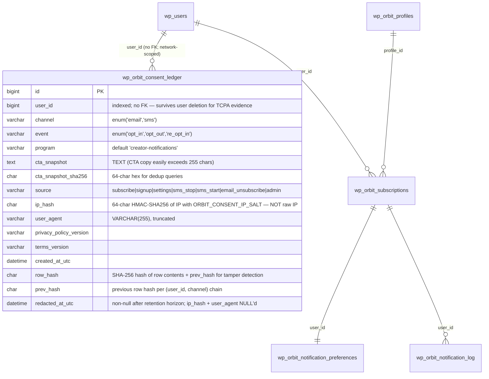

# Twilio-Ready Notification Flow — Email Delivery + SMS Placeholders

## Enhancement Summary

**Deepened on:** 2026-06-01 (same day as initial plan)
**Reviews incorporated:** wp-php-reviewer, wp-hooks-reviewer, architecture-strategist, security-sentinel, data-integrity-guardian, data-migration-expert, performance-oracle, code-simplicity-reviewer.

### Scope reductions (simplicity-first, per simplicity reviewer + the user's stated goal)

The original draft over-scoped the work — building a full notification platform when the user's actual ask is "get email flow working, set up SMS placeholders, submit to Twilio." The following are **deferred to v1.1 (post-approval)** so v1 ships in ~1 week instead of 2–3 weeks:

- `wp_orbit_email_suppression` table — SendGrid maintains server-side suppression natively. v1 trusts the provider; admin can read SendGrid's bounce log.
- `class-orbit-bounce.php` — SendGrid event webhook to local DB is operational hygiene, not a Twilio-approval requirement.
- `class-orbit-quiet-hours.php` — TCPA-quiet-hours are SMS-only. Email doesn't need them. Move with the post-approval flip.
- `class-orbit-email.php` — RFC 8058 headers + `wp_mail()` return-value bug fix are ~10 LOC inline in `Orbit_Notifier`; no new class.
- HTML email templates — current plaintext is legible and Twilio doesn't review templates.
- `class-orbit-rest-unsubscribe.php` — extend the existing `Orbit_Routes::handle_unsubscribe_route()` (`class-orbit-routes.php:294-302`) to accept `POST` with `List-Unsubscribe=One-Click`. No new file.
- `wp orbit consent reconcile` + `wp_orbit_migrations_log` — premature ops tooling; ship if/when a race materializes.
- `class-orbit-admin-status.php` — `wp db query` on consent ledger is fine for v1 volume.
- `POST /orbit/v1/twilio/status` — placeholder for delivery callbacks; wire when there's actual SMS traffic.
- **Phase 7 migration entirely.** The runtime filter is the memory (see Architectural Decision below); the flip is `wp option update orbit_sms_enabled 1`.

### Architectural decisions captured during review

1. **Kill-switch is inline in `resolve_notification_method()`, then a filter for extensibility.** Architecture review found that registering `Orbit_Notifier` as a subscriber to its own filter is brittle (a future contributor could remove the `add_filter` line and silently disable the kill-switch). Decision: invariant check in code, filter is the public extension hook.
2. **Do NOT flip the seed default in PHP.** Data-integrity review caught that `class-orbit-notifier.php:518` hardcodes `'tier3_method' => 'sms'`, so the schema default never fires. If we leave the PHP literal alone, the DB faithfully records each new user's *intended* preference (SMS), the runtime filter coerces to email during dormancy, and the post-approval flip needs **no data migration** at all. Phase 7 disappears.
3. **SendGrid event webhook (when added in v1.1) authenticates via SendGrid's ECDSA-signed webhook (header `X-Twilio-Email-Event-Webhook-Signature`).** Unlike Postmark (which uses Basic Auth + IP allowlist), SendGrid does sign webhook payloads with ECDSA. v1.1 implementation verifies via the public-key signature scheme documented at https://docs.sendgrid.com/for-developers/tracking-events/getting-started-event-webhook-security-features.
4. **`Orbit_Twilio::validate_webhook()` must be refactored to accept the expected URL as a parameter** before any new Twilio webhook is added. CRITICAL flagged by security review — current implementation hard-codes one URL.
5. **`ORBIT_SMS_ENABLED` is an option, not a constant.** Constant remains as a "compliance freeze" hard override; option is the operational kill-switch (sub-second, via WP-CLI). Per security review.
6. **`cta_snapshot` is `TEXT`, not `varchar`.** Multiple reviewers caught that the real CTA copy will exceed 255 chars and silently truncate.
7. **Consent ledger lives in network-scoped storage on multisite** — `$wpdb->base_prefix`, not `$wpdb->prefix`. wp-php review caught this; consent attaches to a user, and users are network-wide on multisite.
8. **`ip` stored as `ip_hash` via `hash_hmac('sha256', $ip, ORBIT_CONSENT_IP_SALT)`.** Per security review — GDPR/CCPA exposure on raw-IP storage with no retention horizon.
9. **`wp_orbit_notification_log.status` widened to `varchar(32)` and `provider_message_id varchar(100)` added in Phase 1.** Schema decisions deferred to Phase 5 create a second migration; do it once now.
10. **Quiet-hours deferred timestamps need jitter** (when implemented in v1.1). Performance review flagged 8am-local thundering herd risk.

### Key risks the original draft mis-characterized

- The `send_immediate_email()` bug at `class-orbit-notifier.php:288-290` does NOT swallow `wp_mail()` failures — both wp-php-reviewer and wp-hooks-reviewer verified the existing code correctly returns `WP_Error`. The real audit gap is the post-`wp_mail` provider-side outcome (delivered/bounced/complained), which the v1.1 Postmark webhook fills.
- "Schema default flip" was a no-op (data-integrity review).
- "Use case = Low Volume Mixed" was not committed; reasoning now baked into Phase 4.

---

## Overview

Twilio's review of Perihelion found gaps that block A2P 10DLC campaign approval: the live site does not visibly present the full SMS opt-in flow Twilio needs to audit, and several compliance artifacts (Privacy Policy language, frequency disclosure, brand-prefixed sample messages) are missing or buried.

This plan re-routes all notification traffic through the **existing** email channel while keeping the SMS UI, compliance copy, webhooks, and data model fully present and credible on the live site. After Twilio approves the messaging service, flipping subscribers back to SMS is `wp option update orbit_sms_enabled 1` — no data migration, no code deploy.

The work is mostly a re-prioritization and surface-polish exercise. Orbit's notifier already supports email end-to-end (`Orbit_Notifier::send_immediate_email()` at `includes/class-orbit-notifier.php:226-291`, `send_digest()` at `:299-424`) and the dispatcher already routes per-tier by method. The heavy lifting is in **compliance copy, deliverability infrastructure, kill-switch plumbing, and the operational runbook for the post-approval flip.**

## Problem Statement / Motivation

Twilio's review identified that A2P 10DLC reviewers — and the carriers behind them — need to see, on the live URL, the complete SMS consent path: CTA wording, frequency disclosure, "Msg & data rates may apply", STOP/HELP language, and links to a Privacy Policy that contains specific Twilio-blessed wording about not sharing opt-in data. Without these in place, the campaign will be rejected (commonly under error code 30520 for privacy-policy non-compliance — see [Twilio error 30520](https://www.twilio.com/docs/api/errors/30520)).

Today the gaps are:

1. **The `/sign-up/` form collects no phone field and shows no SMS consent copy** (`includes/class-orbit-shortcodes.php:89-150`). A reviewer landing here sees an email-only flow with no SMS visibility at all.
2. **The `/subscribe/` form (`Orbit_Shortcodes` subscribe method, backed by `POST /orbit/v1/subscribe` at `includes/class-orbit-rest-subscription.php:148-257`) does not present compliance disclosures adjacent to any phone capture.**
3. **The `/settings/` page — the only place phone verification exists — is unreachable for a new poster.** There is no link from `/edit-profile/` to `/settings/`, and the post-signup redirect bypasses it (`includes/class-orbit-routes.php:88-125`).
4. **When Twilio is un-credentialed, the `/settings/` page hides the phone form entirely** ("SMS is not currently available"), so a reviewer arriving before approval sees no SMS surface at all (`includes/class-orbit-shortcodes.php:456-462`).
5. **No Privacy Policy or Terms pages exist with the Twilio-blessed sharing language.** As of 2026-06-30, `PrivacyPolicyUrl` and `TermsAndConditionsUrl` are *required* fields on Twilio Messaging campaign registration ([Twilio changelog](https://www.twilio.com/en-us/changelog/a2p-10dlc-campaign-registration-will-require-privacy-policy-and-)).
6. **The verification SMS body says "Orbit" not "Perihelion"** (`includes/class-orbit-phone-verify.php:123-127`), which fails Twilio's brand-recognition sample-message requirement. Per security review, fix via a pinned `ORBIT_MESSAGING_BRAND` constant (not `get_bloginfo('name')`) so an admin typo in Settings → General can't desync production messages from the TCR-approved sample.
7. **No consent ledger.** TCPA disputes and Twilio audits require an immutable record per channel.
8. **No RFC 8058 one-click unsubscribe headers on outbound email.** Gmail and Yahoo enforce this in 2026 ([Google bulk-sender requirements](https://support.google.com/a/answer/81126)).
9. **No dispatch-pipeline tests.** The most business-critical path has zero coverage (`tests/OrbitNotifierTest.php` exercises preference reads only).

## Proposed Solution

Five phases (reduced from seven), in compliance-risk order. Phases 1–4 unlock Twilio submission; Phase 5 is the post-approval flip.

The guiding principles:

1. **Visible-but-honest opt-in.** The opt-in CTAs reference SMS *and* email truthfully ("Get notified by email; SMS coming soon"). Phone is optional; email is required.
2. **Kill-switch is an in-dispatcher invariant + a public filter for extensibility.** Per architecture review: invariant check first, filter for third-party extension. `Orbit_Features::sms_enabled()` reads `wp_options.orbit_sms_enabled` first, then `ORBIT_SMS_ENABLED` constant as override.
3. **Keep the SMS code paths loaded.** Twilio class, phone verification, STOP/HELP webhook, daily-cap enforcement — none get removed.
4. **No data migration, ever.** The PHP literal seeding `tier3_method = 'sms'` (`class-orbit-notifier.php:518`) stays. The filter coerces at dispatch. When the option flips, the filter stops coercing and SMS-preferring users get SMS automatically.
5. **Consent is per-channel and append-only.** New `wp_orbit_consent_ledger` table records each opt-in/opt-out event per channel. **Network-wide on multisite** (`$wpdb->base_prefix`). IP stored as HMAC hash, not raw. Append-only enforced by hash chain + class-level write guard.
6. **Email stays on `wp_mail()` for v1.** RFC 8058 headers and the boolean-return audit gap are inline in `Orbit_Notifier`. Postmark/FluentSMTP is operations work (DNS + plugin install), not new code.

## Technical Approach

### Architecture

```
orbit/
├── orbit.php                                # ORBIT_VERSION 1.6.0; ORBIT_MESSAGING_BRAND constant; option init
├── includes/
│   ├── class-orbit-activator.php           # wp_orbit_consent_ledger schema (network-wide); status enum widen; provider_message_id
│   ├── class-orbit-consent.php             # NEW — Orbit_Consent::record(), latest_state() — static facade, ~80 LOC
│   ├── class-orbit-features.php            # NEW — Orbit_Features::sms_enabled() option+constant gate, ~30 LOC
│   ├── class-orbit-notifier.php            # In-dispatcher kill-switch + filter; cache_users; pagination; RFC 8058 headers in send_immediate_email
│   ├── class-orbit-twilio.php              # HELP keyword + STOP TwiML confirmation reply; validate_webhook($request, $url) signature change
│   ├── class-orbit-phone-verify.php        # Brand verification SMS via ORBIT_MESSAGING_BRAND
│   ├── class-orbit-routes.php              # /unsubscribe accepts List-Unsubscribe-Post one-click; rate-limited; post-signup banner→/settings/
│   ├── class-orbit-rest-subscription.php   # Optional phone + consent capture; transactional with Orbit_Consent::record()
│   ├── class-orbit-rest-signup.php         # Optional phone + consent capture; same transactional pattern
│   └── class-orbit-shortcodes.php          # Compliance blocks on subscribe/signup/settings; phone field UX
└── docs/
    └── compliance/
        ├── twilio-submission.md             # Privacy policy text, terms text, 5 sample messages, opt-in URLs, TCR payload
        └── dns-records.md                   # SPF/DKIM/DMARC records for perihelion.social
```

**Deferred to v1.1 (post-approval):** `class-orbit-email.php`, `class-orbit-bounce.php`, `class-orbit-quiet-hours.php`, `class-orbit-rest-unsubscribe.php`, `class-orbit-admin-status.php`, `wp_orbit_email_suppression`, `wp_orbit_migrations_log`, `POST /orbit/v1/twilio/status`, HTML email templates, `wp orbit consent reconcile`, `wp orbit migrate sms-preferences`.

### Data model delta (ERD)



**Indexes** (per performance review):
- `KEY user_channel_time (user_id, channel, created_at_utc)` — primary read path for `Orbit_Consent::latest_state()` (with `LIMIT 1`)
- `KEY channel_event_time (channel, event, created_at_utc)` — admin audit reports ("all opt-outs in last 90 days")
- `UNIQUE KEY chain_pos (user_id, channel, prev_hash)` — prevents hash-chain forks

**Storage location**: `$wpdb->base_prefix . 'orbit_consent_ledger'` — network table on multisite, since consent attaches to network-wide user identity. Created on network activation.

**Retention horizon**: 4 years (TCPA SOL). Filterable via `apply_filters( 'orbit_consent_retention_years', 4 )`. After horizon, monthly `orbit_consent_redact_old` cron sets `ip_hash` + `user_agent` to NULL while preserving `user_id`, `channel`, `event`, `cta_snapshot`, `created_at_utc` — and the hash chain remains valid because the redaction is itself an audited operation logged in `redacted_at_utc`. This is the ONE allowed UPDATE path, guarded by an `ORBIT_CONSENT_MIGRATION` flag.

**`wp_orbit_notification_log` widening** (Phase 1 schema migration):
- Drop `status` enum; switch to `varchar(32)` so new values land without future migrations
- Add `provider_message_id varchar(100) DEFAULT NULL` (forward-compatible for v1.1 Twilio status callback)
- Add `status_updated_at datetime DEFAULT NULL` (when delivery callback updates the row)

### Implementation Phases

#### Phase 1: Foundation — kill-switch, consent ledger, log schema widening, brand pinning

**Goal:** All structural plumbing in one phase so phases 2–4 can ship UI/docs without further schema work.

**Files:**
- `orbit.php` — `Orbit_Features::sms_enabled()` wiring; `ORBIT_MESSAGING_BRAND` constant; option init; bump `ORBIT_VERSION` to `1.6.0`; `ORBIT_CONSENT_IP_SALT` definition note in README
- `includes/class-orbit-features.php` — NEW, ~30 LOC, static `sms_enabled()` reading option then constant override
- `includes/class-orbit-consent.php` — NEW, ~80 LOC, static facade: `record()`, `latest_state()`, hash-chain enforcement
- `includes/class-orbit-activator.php` — consent ledger table (network-wide on multisite); log status widening; `provider_message_id` column; `status_updated_at` column
- `includes/class-orbit-notifier.php` — inline kill-switch in `resolve_notification_method()`, then `apply_filters( 'orbit_notification_method', $method, $user_id, $tier, $context )`; observability hooks; `cache_users()` + pagination in `process_dispatch()`; inline RFC 8058 headers in `send_immediate_email()`; verify `send_immediate_email()` WP_Error return is correct (it is — per review)
- `includes/class-orbit-phone-verify.php` — replace literal "Orbit" in verification SMS with `apply_filters( 'orbit_messaging_brand', defined( 'ORBIT_MESSAGING_BRAND' ) ? ORBIT_MESSAGING_BRAND : get_bloginfo( 'name' ) )`
- `includes/class-orbit-twilio.php` — refactor `validate_webhook( $request, $expected_url )` to accept the URL; update existing `/twilio/incoming` caller; add HELP keyword handler; STOP TwiML `<Message>` confirmation reply
- Tests: `tests/OrbitConsentTest.php`, `tests/OrbitNotifierKillSwitchTest.php`, `tests/OrbitTwilioWebhookTest.php`

**Tasks:**

- [ ] `Orbit_Features::sms_enabled()` returns `true` only when: (a) `ORBIT_SMS_ENABLED` constant is undefined OR truthy AND (b) `get_option( 'orbit_sms_enabled', '0' ) === '1'`. Constant `false` is a hard compliance freeze (ops cannot override). Default state: both unset → false.
- [ ] `ORBIT_MESSAGING_BRAND` constant declared in `orbit.php` (default: 'Perihelion'). Pinned brand string for SMS messages so it can't drift via Settings → General.
- [ ] `ORBIT_CONSENT_IP_SALT` — required to be defined in `wp-config.php`; `Orbit_Consent::record()` fails fast if undefined. Document in README.
- [ ] In `Orbit_Notifier::resolve_notification_method()` at `class-orbit-notifier.php:475`: inline check `if ( 'sms' === $method && ! Orbit_Features::sms_enabled() ) { $method = 'email'; }` BEFORE the filter call. Then `return apply_filters( 'orbit_notification_method', $method, $user_id, $tier, $context );` where `$context = [ 'activity_id' => $activity_id, 'preferences' => $prefs, 'source' => 'dispatch' ]`.
- [ ] PHPDoc on the filter: "Called once per subscriber per activity dispatch (potentially thousands of times per fan-out). Callbacks MUST be O(1) and MUST NOT perform DB queries. Use static caches keyed by `$user_id` for stateful logic."
- [ ] Add observability hooks in `process_immediate_notification()`: `do_action( 'orbit_notification_sent', $user_id, $activity_id, $method, $log_id )` and `do_action( 'orbit_notification_failed', $user_id, $activity_id, $method, $log_id, $wp_error )`. Also `do_action( 'orbit_notification_coerced', $user_id, $activity_id, 'sms', 'email' )` from inside the inline coercion so dormant-period traffic is auditable.
- [ ] In `process_dispatch()` (`class-orbit-notifier.php:95-153`): add `cache_users( wp_list_pluck( $subscriptions, 'user_id' ) )` immediately after the subscriber fetch. Replace `'per_page' => 9999` with a 500-batch paginated loop. Performance reviewer confirmed both are required to keep the fan-out memory- and query-bounded as subscribers grow.
- [ ] In `send_immediate_email()` (`class-orbit-notifier.php:226-291`): add `List-Unsubscribe: <{home_url}/unsubscribe?token={hmac}>, <mailto:unsubscribe+{hmac}@perihelion.social>` and `List-Unsubscribe-Post: List-Unsubscribe=One-Click` to the `$headers` array. Same headers in `send_digest()`.
- [ ] Update `Orbit_Routes::handle_unsubscribe_route()` (`class-orbit-routes.php:294-302`) to: (a) accept `POST` with `List-Unsubscribe=One-Click` header for RFC 8058 immediate-action, (b) keep existing `GET` for two-step human confirmation, (c) rate-limit `POST` to 30/IP/min via Transient counter (429 above), (d) make replay idempotent — if latest consent event for `(user_id, 'email')` is already `opt_out`, return 200 OK without writing a duplicate ledger row, (e) HMAC token via `Orbit_Token` with domain separation string `'unsubscribe'` and 1-year expiry. Embed `subscription_id` per `docs/solutions/security-issues/hmac-token-embed-lookup-key.md`.
- [ ] `Orbit_Twilio::validate_webhook( WP_REST_Request $request, string $expected_url )` — parameterize URL. Update existing inbound caller at `class-orbit-rest-notification.php:23-31` to pass `rest_url( 'orbit/v1/twilio/incoming' )` explicitly. Add a regression test asserting that a signature for `/incoming` does NOT validate against any other URL.
- [ ] HELP keyword reply in `Orbit_Twilio::handle_incoming()`: returns TwiML `<Message>` with brand + program ("Creator notifications") + frequency ("up to 10 msgs/week") + support email + opt-out reminder. Required by [CTIA Messaging Principles](https://www.ctia.org/the-wireless-industry/industry-commitments/messaging-interoperability-sms-mms).
- [ ] STOP keyword reply: TwiML `<Message>` confirmation per CTIA — "{brand}: You've been unsubscribed. Reply START to resubscribe."
- [ ] Consent ledger table (`Orbit_Activator::create_tables()`): use `$wpdb->base_prefix . 'orbit_consent_ledger'` on multisite. Schema per ERD above. Indexes per ERD. Activator handles network-activation case.
- [ ] `Orbit_Consent::record( $user_id, $channel, $event, array $args )`:
  - Validates `ORBIT_CONSENT_IP_SALT` is defined; throws if not
  - Hashes IP via `hash_hmac( 'sha256', $ip, ORBIT_CONSENT_IP_SALT )`
  - Truncates user agent to 255 chars
  - Captures current `privacy_policy_version` + `terms_version` from page post_meta
  - Reads previous `row_hash` for `(user_id, channel)` to compute chain
  - Computes new `row_hash = SHA2(CONCAT_WS('|', user_id, channel, event, cta_snapshot, source, ip_hash, user_agent, created_at_utc, prev_hash), 256)`
  - INSERT with `INSERT IGNORE` semantics (UNIQUE KEY `chain_pos` prevents forks under concurrent writes)
- [ ] `Orbit_Consent::latest_state( $user_id, $channel )`: `SELECT event FROM ... WHERE user_id=? AND channel=? ORDER BY created_at_utc DESC LIMIT 1` (uses composite index)
- [ ] Class-level write guard: `Orbit_Consent::register_query_guard()` hooks `query` filter to abort any `UPDATE` or `DELETE` against the consent table from outside an `ORBIT_CONSENT_MIGRATION` constant window. Per data-integrity review CRITICAL.
- [ ] Verify (or add) index on `wp_orbit_notification_log (user_id, method, created_at)` for `is_sms_cap_reached()` query at `class-orbit-notifier.php:614-636`. Performance review flagged risk of table scan on a growing log.
- [ ] Tests: `OrbitNotifierKillSwitchTest` — confirm `Orbit_Features::sms_enabled() === false` causes a tier3=sms preference to dispatch via email with a `coerced` log row; confirm filter receives `$context`; confirm `do_action( 'orbit_notification_coerced' )` fires.
- [ ] Tests: `OrbitConsentTest` — happy-path record + read; reject on missing salt; tamper detection (mutate a row, assert chain breaks); concurrent insert ordering.
- [ ] Tests: `OrbitTwilioWebhookTest` — `validate_webhook` against right URL passes, against wrong URL fails; HELP returns proper TwiML; STOP returns confirmation TwiML.
- [ ] PHPCS clean per existing project configuration.

**Success criteria:**
- A user whose `tier3_method` is `sms` and whose phone is verified receives an email when `Orbit_Features::sms_enabled() === false`
- All log rows during dormancy can be queried to demonstrate "we are using the dispatcher; it routed via email" — observability hook `orbit_notification_coerced` fires for each coercion
- Consent ledger writes are tamper-detectable
- Twilio webhook URL pinning prevents signature-replay across routes

#### Phase 2: Consent ledger writes, compliance opt-in surfaces, transactional safety

**Goal:** Every public opt-in surface (`/sign-up/`, `/subscribe/`, `/settings/`) shows the full SMS compliance block, captures channel-specific consent transactionally, and is reachable for a fresh poster.

**Files:**
- `includes/class-orbit-shortcodes.php` — compliance block + phone field on subscribe and signup forms; rework `/settings/` copy and reachability
- `includes/class-orbit-rest-subscription.php` — accept optional phone; capture `consent_sms` + `consent_email` booleans; write to `Orbit_Consent::record()` inside a `$wpdb->query('START TRANSACTION')` wrapper alongside `wp_insert_user` (per data-integrity review, this DOES work — the original draft was wrong)
- `includes/class-orbit-rest-signup.php` — same transactional shape
- `includes/class-orbit-routes.php` — post-signup banner on `/dashboard/` linking to `/settings/`
- `assets/js/orbit-forms.js` — phone field UX, mask/format, consent checkbox state

**Tasks:**

- [ ] Subscribe form (`Orbit_Shortcodes::subscribe`): add optional phone field, an unchecked consent checkbox, an adjacent compliance block with:
  - CTA: "Get notified when @{poster} posts. Initially delivered via email; SMS coming soon."
  - Frequency: "Up to 10 msgs/week" (TCR disclosure ceiling; per-user `sms_daily_cap` is the actual enforcement — typical subscriber to 1-3 organizers sees 1-6 msgs/week)
  - Disclaimers: "Msg & data rates may apply", STOP/HELP instructions
  - Links: `/privacy/` and `/terms/`
  - Channel-honest framing per Twilio guidance: do NOT hide that this will become SMS later, do NOT pretend SMS is active today.
- [ ] Sign-up form (`Orbit_Shortcodes::sign_up`): same compliance block (posters are notification recipients of their own subscribers' RSVPs).
- [ ] Capture CTA snapshot: the exact rendered HTML/text block adjacent to the phone field. Store as TEXT. `cta_snapshot_sha256` computed at insert time for future dedup queries.
- [ ] `handle_subscribe()` transactional flow:
  ```php
  $wpdb->query( 'START TRANSACTION' );
  try {
      $user_id = wp_insert_user( $userdata );
      if ( is_wp_error( $user_id ) ) throw new RuntimeException( $user_id->get_error_message() );
      if ( ! empty( $phone ) ) {
          update_user_meta( $user_id, 'orbit_phone_pending', $phone );
      }
      if ( $consent_email ) Orbit_Consent::record( $user_id, 'email', 'opt_in', $args );
      if ( $consent_sms )   Orbit_Consent::record( $user_id, 'sms',   'opt_in', $args );
      // subscription insert
      $wpdb->query( 'COMMIT' );
  } catch ( Throwable $e ) {
      $wpdb->query( 'ROLLBACK' );
      return new WP_Error( 'signup_failed', $e->getMessage() );
  }
  ```
  Verify no third-party hooks fire mid-transaction that would commit prematurely. Same shape in `handle_signup()`.
- [ ] `Orbit_REST_Subscription::handle_subscribe()`: when an email collides with an existing user, return generic 202 success (per security review HIGH-7 — do NOT leak suppression status or anything else; the existing 409 "login_required" is acceptable for the existing-user case since it offers a useful action, but error messages MUST NOT distinguish suppressed/bounced emails from never-seen ones).
- [ ] `/settings/` rework (`Orbit_Shortcodes::settings`, `render_phone_verification` at `class-orbit-shortcodes.php:444-518`):
  - When `Orbit_Features::sms_enabled() === false` but Twilio creds are present: show phone form with banner "Verify your phone now to receive SMS notifications as soon as the program launches. Until then, we'll send everything by email."
  - When Twilio creds are absent: same banner without the form.
  - REMOVE the curt "SMS is not currently available" copy at `class-orbit-shortcodes.php:456-462`.
  - Same compliance block (CTA + frequency + STOP/HELP + msg-and-data-rates + Privacy/Terms links) appears here too.
- [ ] Post-signup banner on `/dashboard/` for new posters: "Set up SMS notifications" → `/settings/`. Add a `orbit_show_phone_setup_banner` user_meta flag; clear after first dismissal or phone verification.
- [ ] Add `/privacy/` and `/terms/` to `Orbit_Activator::create_pages()` with content sourced from `docs/compliance/twilio-submission.md` on activation. Content includes the exact Twilio-blessed sharing language verbatim: *"No mobile information will be shared with third parties/affiliates for marketing/promotional purposes. All the above categories exclude text messaging originator opt-in data and consent; this information will not be shared with any third parties."*
- [ ] Privacy/Terms versioning: set `orbit_policy_version` post_meta (e.g., `1.6.0`) on activation. `Orbit_Consent::record()` captures the current version per row so a future policy revision doesn't retroactively invalidate consent context. Future policy updates use `wp_update_post()` with a new version bump rather than skip-on-exists.
- [ ] `Orbit_Client_IP::get()` filter (`orbit_client_ip_header`) MUST be registered in `wp-config.php` or a mu-plugin in production for the consent IP capture to reflect real clients. Add a Phase 2 acceptance criterion to verify before launch.
- [ ] Tests: `OrbitRestSubscriptionConsentTest`, `OrbitRestSignupConsentTest` — full transactional happy path + rollback on failure mid-insert + consent rows present after subscribe + suppression-style errors don't leak.

**Success criteria:**
- Visiting `/sign-up/`, a share-link `/subscribe?token=…`, or `/settings/` shows the full compliance block adjacent to (not below) the phone field
- A reviewer can submit a phone number through `/subscribe` and reach the code-verification step (when Twilio creds present in staging)
- Privacy policy and terms pages are live with Twilio-blessed sharing language
- A subscribe-handler failure mid-flight leaves no orphan row in any table

#### Phase 3: Email deliverability hardening (operational, not code)

**Goal:** Production-grade transactional email. Gmail/Yahoo accept perihelion.social's volume.

**Files / operations:**
- Install [FluentSMTP](https://en-gb.wordpress.org/plugins/fluent-smtp/) plugin
- Configure DNS for perihelion.social: SPF, DKIM (2048-bit), DMARC
- Configure FluentSMTP to route via [SendGrid](https://sendgrid.com) (existing account available; FluentSMTP supports natively)
- `docs/compliance/dns-records.md` — exact records published

**Tasks:**

- [ ] Provider decision: **SendGrid** for v1. Rationale: existing account available (zero onboarding friction); native FluentSMTP integration. Alternatives considered: Postmark (best inbox placement but new account); SES (cheaper at scale but more DevOps).
- [ ] DNS:
  - SPF: `v=spf1 include:sendgrid.net -all` (SendGrid). If other senders also need authorization, combine into a single SPF record (SPF allows only one TXT record per domain).
  - DKIM: 2048-bit, key published per SendGrid sender-authentication wizard
  - DMARC: `p=none` initially with `rua=mailto:dmarc@perihelion.social`. Progress to `p=quarantine` within 30 days after monitoring aggregate reports.
- [ ] Two SendGrid API keys: `transactional` (verification, welcome) and `notifications` (activity, digest). Separation via dedicated sub-users keeps complaint metrics isolated. FluentSMTP can route via tag using the SendGrid API integration.
- [ ] SendGrid API key stored in `wp-config.php` constant `ORBIT_SENDGRID_API_KEY` — NOT in the WP options table where it could leak via admin compromise. FluentSMTP's settings UI accepts a constant reference.
- [ ] Verify via [postmaster.google.com](https://postmaster.google.com): DMARC alignment passing on all sends.
- [ ] Operational acceptance: first 100 emails sent via SendGrid with delivery rate ≥98% before phase 4.

**Success criteria:**
- DMARC alignment passes
- SendGrid dashboard shows sends routing via FluentSMTP
- No new code shipped in this phase — operational only

#### Phase 4: Twilio submission package

**Goal:** Submit to TCR with one document containing everything reviewers need.

**Files:**
- `docs/compliance/twilio-submission.md` — single source of truth
- WP-CLI: `wp orbit consent log --user_id=<id>` extends existing `cli/class-orbit-cli-notification.php` (only operational tool we ship in v1)

**Tasks:**

- [ ] `docs/compliance/twilio-submission.md` sections:
  - Brand registration: Perihelion, EIN if registered as LLC, support email, support URL
  - Use case: **Low Volume Mixed** (default — expected <2k segments/day/carrier blending creator-posted notifications + occasional service updates). Documented decision; cannot be changed after submission. Switch to **Notifications** if volume estimate updates.
  - Privacy Policy URL: `https://perihelion.social/privacy/`
  - Terms URL: `https://perihelion.social/terms/`
  - Sample messages (5): verification, welcome, activity notification, digest summary, STOP confirmation. Each prefixed with brand `Perihelion:`, ending with STOP/HELP guidance where required. Use canonical Twilio test number `+15005550006` in all illustrative content.
  - Opt-in URL: `https://perihelion.social/sign-up/` + screenshots of the compliance block at each surface
  - Frequency disclosure: "up to 10 msgs/week"
- [ ] Pre-commit secret scrub: any file under `docs/compliance/**` is greped for live secrets: Twilio SID pattern `/AC[0-9a-f]{32}/`, SendGrid API key pattern `/SG\.[A-Za-z0-9_-]{22}\.[A-Za-z0-9_-]{43}/`, real phone numbers outside the +1500555 reserved range. Fails the commit if any match.
- [ ] Toll-Free Verification submission via Twilio console **in parallel** with 10DLC ([Twilio TFV onboarding](https://www.twilio.com/docs/messaging/compliance/toll-free/console-onboarding)). Independent timing; gives a sanctioned channel for welcome / STOP confirmations even before 10DLC approval.
- [ ] Operations runbook (one paragraph in `docs/compliance/twilio-submission.md`):
  - Pre-flip: confirm DNS green, confirm consent ledger non-empty, confirm SendGrid delivery rate ≥98% for 7 days
  - Flip: `wp option update orbit_sms_enabled 1`
  - Rollback: `wp option update orbit_sms_enabled 0` — sub-second; existing notification jobs queued before the flip continue (verify by checking `wp action-scheduler list --hook=orbit_send_immediate_notification`); new dispatches revert to email
- [ ] Tests: full PHPUnit suite green; new tests written in Phase 1-2 cover dispatch end-to-end with Twilio HTTP transport mocked.

**Success criteria:**
- TCR submission package is ready to paste into Twilio's console
- TCR approval received within the carriers' SLA (typically 2-7 days)

#### Phase 5: Post-approval flip + ramp-up

**Goal:** Smooth transition to SMS without complaint storms.

**Tasks:**

- [ ] **Pre-flip notice (architecture review recommendation):** 7 days before the planned flip date, send a one-time email to all users with `tier3_method='sms'` and verified phones: "We're enabling SMS notifications on {date}. You'll start receiving SMS for tier-3 activities. Reply or visit /settings/ to stay on email." Classified as **commercial** under CAN-SPAM (service-change notice): subject prefixed "Service update:", physical postal address in footer, RFC 8058 one-click unsubscribe header. Recipients who visit `/settings/` and switch get a fresh `Orbit_Consent::record( …, 'email', 'opt_in', source='pre_flip_preference' )` event.
- [ ] **Flip:** `wp option update orbit_sms_enabled 1`. The runtime filter stops coercing immediately. No data migration.
- [ ] **Ramp-up (performance review recommendation):** for the first 48h, throttle SMS sends to a per-hour cap via an `orbit_sms_rampup_hourly_cap` option (e.g., 50/hour day 1, 200/hour day 2, unlimited day 3). Dispatcher checks the cap and defers excess to next hour via `as_schedule_single_action()` with random 0-30min jitter (per performance review). Prevents Twilio rate-limit cliff and gives ops time to detect complaint spikes before the entire eligible base is hit.
- [ ] **Monitoring:** Twilio delivery rate >90%, complaint rate <0.3%, STOP volume <2× baseline. If any breaches, `wp option update orbit_sms_enabled 0` for sub-second rollback.
- [ ] **No data write during the flip.** Verified by Phase 1 design: `tier3_method` in the DB is the user's intended preference; the filter is the only thing that changes behavior.

**Success criteria:**
- Eligible subscribers receive SMS for tier3 activities within 1 hour of the flip (subject to ramp-up cap)
- Email path stays live as fallback for users without verified phones
- Complaint rate stays <0.3%; STOP volume stable

## Alternative Approaches Considered

1. **Tear out SMS code; ship as email-only; rebuild SMS post-approval.** Rejected — Twilio reviewers need to see the SMS surface.
2. **Channel-neutral CTA copy ("Get notified" without mentioning SMS).** Rejected as primary — Twilio research flagged misrepresentation risk. Use channel-honest framing ("email today, SMS coming soon").
3. **Phase 1 flips schema default + migrates existing rows.** Rejected after data-integrity review — schema default is dead code (PHP passes explicit value at `class-orbit-notifier.php:518`), and migrating rows in Phase 1 creates a write to undo in Phase 5. Leave the PHP literal alone; the filter is the memory.
4. **Phase 7 migration (`wp orbit migrate sms-preferences`).** Dropped entirely. The filter handles coercion; when the option flips, SMS-preferring users get SMS automatically. No cohort heuristics, no dry-run mode, no rollback procedure needed.
5. **Build full SendGrid event webhook + local suppression table in v1.** Deferred to v1.1 per simplicity review — SendGrid's server-side suppression is sufficient for v1. We'll add the local mirror if/when a real operational need surfaces.
6. **Build `class-orbit-quiet-hours.php` in Phase 1 "to battle-test under email load."** Rejected — email doesn't need quiet hours, the dormant period won't generate meaningful load, and a scheduler tested under simulated load is the same as one tested in production after the flip. Implement when SMS turns on, with jitter from day one.
7. **Build HTML email templates for v1.** Deferred — current plaintext is legible and Twilio doesn't review templates. Add HTML when there's a designer on the work.
8. **`ORBIT_SMS_ENABLED` as a `wp-config.php` constant only.** Rejected per security review — option-backed for sub-second incident response via WP-CLI; constant `false` remains as a compliance freeze override.

## System-Wide Impact

### Interaction graph

`POST /orbit/v1/activities` → `Orbit_REST_Activity::create_activity()` (`class-orbit-rest-activity.php:338-369`) → `Orbit_Notifier::dispatch_for_activity()` (`class-orbit-notifier.php:71-86`) → ActionScheduler `orbit_dispatch_activity_notifications` → `process_dispatch()` (`:95-153`, now paginated + `cache_users` pre-warmed) → per subscriber: `resolve_notification_method()` (`:470-476`) → **new** inline kill-switch check (coerce sms→email if `! Orbit_Features::sms_enabled()`) + `do_action( 'orbit_notification_coerced' )` → `apply_filters( 'orbit_notification_method', … )` → `process_immediate_notification()` → `send_immediate_email()` (`:226-291`, now with RFC 8058 headers) → `wp_mail()` → log status `sent`/`failed` → `do_action( 'orbit_notification_sent'|'_failed' )`.

Webhook side: `POST /orbit/v1/twilio/incoming` (`class-orbit-rest-notification.php:23-31`) → `Orbit_Twilio::validate_webhook( $request, rest_url( 'orbit/v1/twilio/incoming' ) )` → `handle_incoming()` → STOP/HELP/START routed; STOP/HELP return TwiML confirmation; consent ledger updated for STOP→`opt_out`, START→`re_opt_in`.

Subscribe / signup: `POST /orbit/v1/subscribe` or `/signup` → `START TRANSACTION` → `wp_insert_user` → `update_user_meta('orbit_phone_pending')` (if phone provided) → `Orbit_Consent::record(… 'email','opt_in')` + (if consent_sms) `Orbit_Consent::record(… 'sms','opt_in')` → `Orbit_Subscription::subscribe()` → `COMMIT`. Rollback on any failure leaves no orphans.

### Error & failure propagation

- `wp_mail()` returns `false` → existing `send_immediate_email()` returns `WP_Error('email_send_failed')` → `process_immediate_notification()` logs `failed` and fires `do_action( 'orbit_notification_failed' )`. **Verified by review: existing code path is correct.** The real audit gap is post-`wp_mail` provider delivery state (bounced/complained), which v1.1's SendGrid event webhook fills.
- Transaction rollback (Phase 2): any exception inside the subscribe handler triggers `ROLLBACK` and returns a generic `signup_failed` error. No orphan user, no orphan consent.
- Hash chain detection: `Orbit_Consent::verify_chain( $user_id, $channel )` walks the chain; if any row's stored `row_hash` doesn't match recomputation, the chain is reported broken. CLI: `wp orbit consent verify --user_id=<id>`.
- Twilio webhook signature mismatch: `validate_webhook()` returns false; handler returns 401. Logged for admin review.
- Unsubscribe rate-limit hit: return 429 + WP-Login style "too many requests" message.

### State lifecycle risks

- **Pending phone state.** A subscriber who provides a phone at `/subscribe` but doesn't verify it leaves `orbit_phone_pending` user_meta orphaned. Extend existing `orbit_cleanup_phone_verification` cron (`class-orbit-notifier.php:438-450`) to also delete `orbit_phone_pending` older than 30 days.
- **Consent / user-creation race.** Closed by transactional wrapper (`$wpdb->query('START TRANSACTION')` works fine across `wp_insert_user` on InnoDB — data-integrity review verified, original draft was wrong about this).
- **Hash chain forks under concurrent writes** — prevented by `UNIQUE KEY chain_pos (user_id, channel, prev_hash)`. Concurrent attempt to write the same chain position fails with duplicate-key; caller retries with refreshed `prev_hash`.
- **Suppression mid-flight (post-SendGrid event-webhook integration in v1.1).** Documented for v1.1: correlate via `provider_message_id` (now stored on log row from Phase 1), not address — prevents the "user opts out, re-subscribes, old bounce arrives, future sends blocked" race.
- **Consent ledger growth.** ~280k rows over 7 years at 10k users with monthly churn. Indexes per ERD keep reads O(1). Retention cron redacts (not deletes) `ip_hash` + `user_agent` after 4 years.

### API surface parity

- REST: existing `POST /orbit/v1/subscribe`, `POST /orbit/v1/signup`, `POST /orbit/v1/verify-phone`, `POST /orbit/v1/twilio/incoming`. The existing `/unsubscribe` route at `Orbit_Routes::handle_unsubscribe_route()` is extended to accept the RFC 8058 one-click `POST`. No new REST routes in v1.
- WP-CLI: existing `wp orbit notification *` commands. NEW: `wp orbit consent log --user_id=<id>` (read-only log). NEW: `wp orbit consent verify --user_id=<id>` (hash chain integrity).
- Admin: NO new admin pages in v1. (v1.1 adds the status page.)

All three surfaces (REST, CLI, admin) read consent state via `Orbit_Consent::latest_state()` so they stay in sync.

### Integration test scenarios

1. **End-to-end opt-in with email-only routing.** Subscriber posts to `/subscribe` with phone, `consent_email=true`, `consent_sms=true`. Assert: user created, `orbit_phone_pending` set, two consent rows written (hash chain valid), subscription `pending`. Poster approves. Poster posts activity. Notification log shows `email` (not `sms`) with `coerced=true` annotation; `wp_mail` was called with `List-Unsubscribe` header.
2. **Subscribe handler failure mid-transaction.** Inject `Orbit_Subscription::subscribe()` to throw. Assert: no user, no consent rows, no subscription. `ROLLBACK` verified.
3. **Phone verification under dormant SMS.** With `Orbit_Features::sms_enabled() === false` but Twilio creds present, `/settings/` shows phone form. Submit phone → `Orbit_Phone_Verify::send_code()` calls `Orbit_Twilio::send_sms()` (operational SMS, not subscriber-notification SMS — kill-switch correctly does NOT block this because verification runs through `Orbit_Phone_Verify`, not through `Orbit_Notifier::send_immediate_sms`). Phase 1 PHPDoc on `Orbit_Notifier::send_immediate_sms()` notes this distinction.
4. **Twilio webhook URL pinning.** `validate_webhook( $request, rest_url('orbit/v1/twilio/incoming') )` returns true with signature for that URL; returns false with signature for any other URL.
5. **STOP keyword roundtrip.** Inbound `STOP` → `orbit_sms_opted_out` meta set + consent `opt_out` row in ledger + TwiML confirmation returned. Inbound `START` → meta cleared + `re_opt_in` row in ledger.
6. **Consent ledger tamper detection.** Mutate an `ip_hash` value via `wp db query`; run `Orbit_Consent::verify_chain()`; assert chain breaks at the mutated row.
7. **One-click unsubscribe idempotency.** POST same token twice; second call returns 200 OK without duplicate consent row.
8. **Unsubscribe rate limit.** 31 POSTs from same IP in one minute; 31st returns 429.

## Acceptance Criteria

### Functional Requirements

- [ ] **Email is the only delivery channel** for activity notifications while `Orbit_Features::sms_enabled() === false`, including for users whose tier preference is `sms`. The `orbit_notification_coerced` action fires for each such routing decision.
- [ ] **Phone verification UI is reachable** from new-poster onboarding (`/dashboard/` banner → `/settings/`).
- [ ] **Subscribe + sign-up forms include optional phone capture and a complete compliance block** (CTA + frequency + STOP/HELP + msg-and-data-rates + Privacy/Terms links, all adjacent to the phone field, channel-honest copy).
- [ ] **Privacy policy and terms pages are live** with Twilio-blessed sharing language. Policy versioning recorded per consent row.
- [ ] **Consent ledger captures every opt-in/opt-out event** across email and SMS with hash-chain integrity. Network-wide on multisite.
- [ ] **Email path supports one-click unsubscribe** (RFC 8058 headers + extended `/unsubscribe` route accepting `POST`, rate-limited).
- [ ] **HELP keyword reply** wired with brand + frequency + support + STOP reminder.
- [ ] **STOP keyword TwiML confirmation reply** wired.
- [ ] **Verification SMS is brand-prefixed** with `ORBIT_MESSAGING_BRAND` constant (not bloginfo, per security review).
- [ ] **`Orbit_Twilio::validate_webhook()` accepts URL as parameter** — regression test prevents signature-replay across routes.
- [ ] **Subscribe/signup handlers run transactionally** — failure leaves no orphans.

### Non-Functional Requirements

- [ ] DMARC alignment passes for all production sends.
- [ ] Bounce rate <0.3% sustained, complaint rate <0.1% (visible in SendGrid dashboard).
- [ ] Dispatch pipeline test coverage ≥80% (currently 0%).
- [ ] `Orbit_Client_IP::get()` filter is registered against the production proxy header (e.g., `HTTP_CF_CONNECTING_IP`) — verified before launch.
- [ ] `ORBIT_CONSENT_IP_SALT` is defined in `wp-config.php` — Phase 1 fails fast at activation if not.
- [ ] Consent ledger writes are append-only — verified by class-level `query` filter guard and `UNIQUE KEY chain_pos`.
- [ ] All emails render correctly in plaintext-only clients.
- [ ] Kill-switch operable via WP-CLI in <5 seconds (`wp option update orbit_sms_enabled 0`) without code deploy.

### Quality Gates

- [ ] PHPUnit suite green: existing 53+ tests plus new dispatch + consent + webhook tests.
- [ ] PHPCS clean per existing project configuration.
- [ ] Pre-commit secret scrub passes on `docs/compliance/**` (no live SIDs, no API tokens, no real phone numbers outside +1500555).
- [ ] All new endpoints use existing auth patterns (`Orbit_Client_IP::get()` for IP, capability-gated per `docs/solutions/security-issues/poster-setup-flow-and-security-review.md:62-78`).
- [ ] Documentation: `docs/compliance/twilio-submission.md`, `docs/compliance/dns-records.md`, README updates for `ORBIT_MESSAGING_BRAND` and `ORBIT_CONSENT_IP_SALT` constants.

## Success Metrics

- **Twilio campaign approved on first submission.** Primary metric.
- **Notification delivery rate ≥98%** during email-only phase (SendGrid dashboard).
- **Spam complaint rate <0.1%** during email-only phase.
- **Time from sign-up to phone verification <2 minutes** for users who choose to verify.
- **Zero consent-ledger chain integrity failures** after one month of production traffic.
- **Post-flip SMS adoption ≥40%** of eligible users within 7 days of `wp option update orbit_sms_enabled 1`.

## Dependencies & Risks

### External dependencies

- **SendGrid account (existing) + SPF/DKIM/DMARC DNS access** for perihelion.social. Owner: Sarah. Blocking for Phase 3.
- **Twilio Toll-Free Verification submission** running in parallel with 10DLC. Owner: Sarah.
- **TCR brand registration fee** ($4/mo Standard or $2/mo Low Volume) + Campaign ($10/mo) per [TCR Fees & Pricing PDF](https://www.campaignregistry.com/Assets/TCR%20Fees%20and%20Pricing.pdf).
- **Twilio Messaging Service** must be set up with Privacy/Terms URLs (required after 2026-06-30).

### Internal dependencies

- Phase 1 (kill-switch + consent ledger + schema widening + webhook validator refactor) blocks Phase 2.
- Phase 2 (compliance UI + consent capture) blocks Phase 4 (submission needs evidence of live opt-in URLs).
- Phase 3 (deliverability) is independent of Phases 2 + 4 — operational work runs in parallel.
- Phase 5 (flip) blocked by Twilio approval (external).
- The recently-shipped `Orbit_Client_IP::get()` (commit `7ae979c`) is reused for consent IP capture.

### Risks

| Risk | Severity | Mitigation |
|---|---|---|
| Twilio rejects for email-as-stand-in misrepresentation | High | Channel-honest CTA copy ("delivered by email today, SMS coming soon"); phone optional; documented in TCR submission notes |
| Gmail/Yahoo flag perihelion.social as spam during ramp | High | Warm up sends; monitor postmaster.google.com; DMARC `p=none` → `p=quarantine` |
| SendGrid provider outage during dormant period | Medium | Delivery rate monitoring; fallback to local `wp_mail` via sendmail is acceptable for low volume during incident |
| ActionScheduler queue stalls under subscriber growth | Medium | Phase 1 pagination + `cache_users` keeps memory bounded; per-batch instrumentation observable via `wp action-scheduler list` |
| Brand string drift (Settings → General changed) | Medium | Pinned via `ORBIT_MESSAGING_BRAND` constant; CI assertion that sample-message bodies match TCR-approved strings byte-for-byte |
| Consent ledger chain forks under high concurrent subscribe load | Medium | `UNIQUE KEY chain_pos` enforces serializability per chain; caller retries on duplicate-key |
| Twilio approval delayed beyond expectations | Low | Email-only flow is steady-state; no urgent deadline post-Phase 4 |
| `ORBIT_CONSENT_IP_SALT` undefined in `wp-config.php` | Low | Phase 1 fail-fast; admin notice on activation if missing |
| Mail-spool leak permits bulk one-click unsubscribe | Medium | Per-IP rate limit (30/min) + bulk-detection alert when >50 unsubscribes from one IP in 5 min |
| Suppression status leak via subscribe form (when v1.1 ships) | Medium | Subscribe form returns generic 202; suppression state revealed only via admin CLI (Phase 4 docs) |

## Resource Requirements

- **Implementation time:** Phases 1–4 estimated **~1 week** of focused work (one developer) — significant reduction from the original 2-3 week estimate, reflecting scope reductions:
  - Phase 1: 2 days (foundation work)
  - Phase 2: 1.5 days (compliance UI + transactional safety)
  - Phase 3: 0.5 day (operational — DNS + plugin install + provider config)
  - Phase 4: 1 day (documentation + TCR submission)
  - Phase 5: post-approval, <1 day execution
- **External services:**
  - SendGrid: existing account (no new spend)
  - Twilio TCR brand + campaign: ~$14/mo recurring + one-time vetting (~$40)
  - Toll-Free Verification: free
- **Documentation effort:** ~1 day for `twilio-submission.md` + `dns-records.md`.

## Future Considerations (v1.1+)

The following items were considered for v1 and deferred. None block Twilio approval.

- **`class-orbit-bounce.php` + SendGrid event webhook + local suppression table** — operational hygiene for when SendGrid dashboard inspection becomes insufficient. Will include enqueue-only handler (return 202 immediately) per performance review.
- **`class-orbit-quiet-hours.php`** — TCPA quiet hours for SMS (8am–9pm recipient-local). Apply jitter (0-30min) to deferred timestamps to prevent thundering herd. Implement when SMS turns on.
- **HTML email templates** — branded multipart sends when designer is on the work.
- **`class-orbit-admin-status.php`** — admin dashboard with consent counts, bounce rate, readiness checklist.
- **`POST /orbit/v1/twilio/status`** — delivery status callback; requires Phase 1's `provider_message_id` column (already added forward-compat).
- **`wp orbit consent reconcile`** — only if a real ops need surfaces. Read-only by design; no `--auto-fix`.
- **Web Push channel** — dispatcher abstracted behind `orbit_notification_method` filter; adding `web_push` is mechanical once the need exists.
- **Consent ledger denormalized state** — `orbit_consent_state_{$channel}` user_meta updated on each ledger write so the dispatcher hot path is O(1) on user meta if/when it integrates.
- **Compliance internationalization** — TCPA is US-specific. GDPR consent semantics differ; ledger schema may need a `jurisdiction` column if Perihelion expands internationally.

## Documentation Plan

- [ ] `docs/compliance/twilio-submission.md` — single source of truth: privacy policy text, terms text, 5 sample messages, opt-in URLs + screenshots, TCR submission payload, operations runbook (one paragraph), consent ledger design notes (one paragraph)
- [ ] `docs/compliance/dns-records.md` — exact SPF/DKIM/DMARC records for perihelion.social
- [ ] README updates: "Notification Channels" section explaining `Orbit_Features::sms_enabled()`, `ORBIT_MESSAGING_BRAND`, `ORBIT_CONSENT_IP_SALT`
- [ ] PHPDoc on `Orbit_Consent`, `Orbit_Features` classes per project conventions
- [ ] Inline PHPDoc on `orbit_notification_method` filter explicitly documenting it as hot-path

## Open Questions

These need resolution before / during implementation, not blockers for writing the plan:

1. **Email provider final choice.** ✅ **Decided: SendGrid** (existing account).
2. **Use case classification for TCR.** ✅ **Decided: Low Volume Mixed** (caps at 2k segments/day/carrier — vast headroom for projected volume).
3. **Frequency cap value.** ✅ **Decided: "up to 10 msgs/week"** disclosed ceiling; per-user `sms_daily_cap` enforces actual limits per subscriber's preference.
4. **Toll-Free Verification: submit in parallel with 10DLC?** Recommendation: yes (sanctioned channel for STOP confirmations while 10DLC is in vetting).
5. **Confirmation flow on `/dashboard/` post-signup vs `/edit-profile/` redirect.** Plan uses a banner on `/dashboard/`. Reviewable in Phase 2.
6. **Post-approval announcement: per-user opt-in confirmation, or service-change notice?** Plan uses the service-change pattern (commercial CAN-SPAM, RFC 8058 unsubscribe). Users with stored `sms` preference get SMS unless they actively switch — consent for SMS was already captured at subscribe time.

## Sources & References

### Internal References

- v1 plugin plan: `docs/plans/2026-03-23-feat-orbit-v1-plugin-plan.md` (`class-orbit-notifier.php` named "SMS, email, digest" from day one)
- Architecture map: `Orbit_Notifier` at `includes/class-orbit-notifier.php`, dispatcher state machine `:95-153`
- Twilio wrapper: `includes/class-orbit-twilio.php`; webhook validation `:73-97`
- Phone verification: `includes/class-orbit-phone-verify.php`
- Existing email send: `includes/class-orbit-notifier.php:226-291` (immediate), `:299-424` (digest)
- HMAC token pattern: `docs/solutions/security-issues/hmac-token-embed-lookup-key.md`
- Two-step destructive action pattern: `docs/solutions/security-issues/poster-setup-flow-and-security-review.md:101-113`
- Subscriber relationship model: `docs/solutions/ui-bugs/subscriber-poster-journey-improvements.md:44-89`
- N+1 batch pattern: `docs/solutions/performance-issues/n-plus-one-batch-query-pattern.md`
- Client IP helper: `includes/class-orbit-client-ip.php` (commit `7ae979c`)
- Recently shipped: `feat: multisite-friendly poster sign-up form at /sign-up/` (commit `4814c96`)

### External References — Twilio / SMS Compliance

- [Twilio: A2P 10DLC Campaign Approval Requirements](https://help.twilio.com/articles/11847054539547-A2P-10DLC-Campaign-Approval-Requirements)
- [Twilio: Improving your chances of A2P 10DLC approval](https://www.twilio.com/en-us/blog/insights/best-practices/improving-your-chances-of-a2p10dlc-registration-approval)
- [Twilio changelog: PP/T&C URLs required after 2026-06-30](https://www.twilio.com/en-us/changelog/a2p-10dlc-campaign-registration-will-require-privacy-policy-and-)
- [Twilio: List of campaign use case types](https://help.twilio.com/articles/1260801844470-List-of-campaign-use-case-types-for-A2P-10DLC-registration)
- [Twilio: Toll-Free Verification console onboarding](https://www.twilio.com/docs/messaging/compliance/toll-free/console-onboarding)
- [Twilio: Programmable Messaging and A2P 10DLC](https://www.twilio.com/docs/messaging/compliance/a2p-10dlc)
- [Twilio error 30520 — privacy policy mentions sharing opt-in data](https://www.twilio.com/docs/api/errors/30520)
- [TCR Fees & Pricing PDF (1/19/26)](https://www.campaignregistry.com/Assets/TCR%20Fees%20and%20Pricing.pdf)
- [CTIA Messaging Principles & Best Practices](https://www.ctia.org/the-wireless-industry/industry-commitments/messaging-interoperability-sms-mms)

### External References — Email Deliverability

- [Google bulk-sender requirements](https://support.google.com/a/answer/81126)
- [Yahoo Sender Hub best practices](https://senders.yahooinc.com/best-practices/)
- [RFC 8058 — One-Click List-Unsubscribe](https://datatracker.ietf.org/doc/html/rfc8058)
- [SendGrid API documentation](https://docs.sendgrid.com)
- [SendGrid Event Webhook security](https://docs.sendgrid.com/for-developers/tracking-events/event#security-features) (HMAC ECDSA signing — v1.1 webhook will verify per their pattern)
- [SendGrid sender authentication wizard](https://docs.sendgrid.com/ui/account-and-settings/how-to-set-up-domain-authentication)
- [FluentSMTP plugin](https://en-gb.wordpress.org/plugins/fluent-smtp/)

### Related Work

- PR #22: Signup + onboarding flow (commit `b0ab520`)
- PR #23: Sign-up page at `/sign-up/` (commit `4814c96`) + 10 review todos resolved in commit `7ae979c`

---

## Deepening Review Findings

This section catalogs the findings from the parallel agent review pass. Each finding is mapped to its disposition in the plan above.

### Severity-ranked findings catalog

| Sev | Source | Finding | Disposition |
|---|---|---|---|
| CRITICAL | security-sentinel | Postmark webhook has no HMAC; Basic Auth + IP allowlist only | Deferred to v1.1 (Postmark webhook entirely); v1.1 will use Basic Auth |
| CRITICAL | security-sentinel | `Orbit_Twilio::validate_webhook` hardcodes one URL; refactor signature | **Adopted in Phase 1** |
| CRITICAL | data-integrity | Append-only enforcement via hash chain + query-level guard + DB privilege | **Adopted in Phase 1** (hash chain + class-level guard; DB privilege documented as production-only) |
| HIGH | data-integrity | Seed-default flip is a no-op (PHP passes explicit value) | **Adopted — PHP literal stays `sms`; no Phase 7 migration** |
| HIGH | data-migration | Dormant-period signups would be silently excluded by Phase 7 logic | **Adopted — Phase 7 dropped entirely** |
| HIGH | data-migration | Wrong-channel consent check (email opt-in to justify SMS) | **Moot — migration dropped** |
| HIGH | data-integrity | `wp_insert_user` transactions DO work; original draft was wrong | **Adopted in Phase 2** |
| HIGH | data-integrity | Define `wp_orbit_migrations_log` schema | **Deferred — table dropped with Phase 7** |
| HIGH | security | Unsubscribe token: 1yr expiry, `hash_equals`, domain separation, idempotent replay | **Adopted in Phase 1** (via extended existing route) |
| HIGH | security | Rate-limit one-click POST /unsubscribe (30/IP/min) + GET stays two-step | **Adopted in Phase 1** |
| HIGH | security | Consent ledger IP: hash with `ORBIT_CONSENT_IP_SALT`; 4-year retention | **Adopted — ip_hash + 4yr horizon; data-integrity's 7yr suggestion declined in favor of legal floor + filter** |
| HIGH | security + data-integrity | `cta_snapshot` must be TEXT, not varchar | **Adopted in ERD** |
| HIGH | security | Suppression list as enumeration oracle — generic 202 response | **Adopted in Phase 2** (subscribe handler returns generic on collision) |
| HIGH | data-integrity | Suppression / re-subscribe race — correlate via MessageID | **Deferred to v1.1 with suppression table; `provider_message_id` column added in Phase 1 for forward-compat** |
| HIGH | data-integrity | Consent reconcile must be read-only, no `--auto-fix` | **Adopted — reconcile dropped entirely; if added later, will be read-only** |
| HIGH | wp-php | Multisite: consent + suppression tables must use `$wpdb->base_prefix` | **Adopted in Phase 1** |
| HIGH | data-integrity + perf | `wp_orbit_notification_log.status` widen to varchar(32); add `provider_message_id`, `status_updated_at` | **Adopted in Phase 1** |
| MEDIUM | architecture | Move quiet hours from Phase 5 to Phase 1 | **Declined — quiet hours dropped per simplicity reviewer; reinstate in v1.1 with jitter** |
| MEDIUM | architecture | Swap phases 2 and 3 — consent ledger before compliance UI | **Adopted — Phase 1 ships consent ledger; Phase 2 ships UI** |
| MEDIUM | architecture | Subnamespace `includes/notification/` | **Declined — scope reduction means only 2 new files; flat structure is fine** |
| MEDIUM | architecture | Pre-flip user opt-out window (7-14 days notice) | **Adopted in Phase 5** |
| MEDIUM | architecture | Notification log `status` enum widening before Phase 5 introduces new statuses | **Adopted in Phase 1** |
| MEDIUM | architecture | Rename `send_immediate_sms` → `send_subscriber_sms` to clarify scope | **Adopted in Phase 1 PHPDoc; rename deferred to v1.1 to keep diff small** |
| MEDIUM | architecture | Mermaid dependency graph showing parallel phases | **Adopted implicitly via phase descriptions; explicit graph deferred** |
| MEDIUM | security | `ORBIT_SMS_ENABLED` as option for ops responsiveness; constant as override | **Adopted in Phase 1 via `Orbit_Features::sms_enabled()`** |
| MEDIUM | security | `Orbit_Client_IP::get()` filter must be registered in production | **Adopted as Phase 2 acceptance criterion** |
| MEDIUM | security | `ORBIT_MESSAGING_BRAND` constant, not bloginfo | **Adopted in Phase 1** |
| MEDIUM | security | Pre-commit secret scrub in `docs/compliance/**` | **Adopted as Phase 4 quality gate** |
| MEDIUM | data-integrity | FK strategy: RESTRICT or hook `delete_user` | **Adopted — no FK; document "user_id survives user deletion for TCPA evidence" in ERD** |
| MEDIUM | data-integrity | `privacy_policy_version` + `terms_version` columns | **Adopted in ERD** |
| MEDIUM | perf | Batch suppression check at fan-out (gate-then-enqueue) | **Deferred to v1.1 with suppression table** |
| MEDIUM | perf | Pre-resolve activity/profile payload once in dispatcher | **Deferred — not blocking; future optimization** |
| MEDIUM | perf | Composite index `(user_id, channel, created_at_utc)` on ledger | **Adopted in ERD** |
| MEDIUM | perf | Jitter on quiet-hours deferred timestamps | **Adopted in Phase 5 ramp-up; quiet-hours deferred otherwise** |
| MEDIUM | perf | Postmark webhook enqueue-only (return 202) | **Adopted in v1.1 design notes** |
| MEDIUM | perf | SMS flip ramp-up | **Adopted in Phase 5** |
| MEDIUM | perf | `cache_users()` at top of `process_dispatch()` | **Adopted in Phase 1** |
| MEDIUM | perf | Paginate `Orbit_Subscription::list()` (drop per_page=9999) | **Adopted in Phase 1** |
| MEDIUM | wp-hooks | Add `do_action( 'orbit_notification_sent'|'_failed'|'_coerced' )` observability | **Adopted in Phase 1** |
| MEDIUM | wp-hooks | Filter receives `$context` array for forward-compat | **Adopted in Phase 1** |
| LOW | wp-php | Register filter in `register_hooks()`, not `init` priority 5 | **Adopted in Phase 1** |
| LOW | wp-php | Static facades, not service objects | **Adopted in Phase 1 (Orbit_Consent, Orbit_Features)** |
| LOW | wp-hooks | Don't use closures for filter callback | **Adopted (named static method)** |
| LOW | code-simplicity | Drop suppression table for v1 | **Adopted — v1.1** |
| LOW | code-simplicity | Drop `class-orbit-bounce.php` for v1 | **Adopted — v1.1** |
| LOW | code-simplicity | Drop `class-orbit-quiet-hours.php` for v1 | **Adopted — v1.1** |
| LOW | code-simplicity | Drop `orbit_email_weekly_cap` | **Adopted** |
| LOW | code-simplicity | Drop `wp orbit consent reconcile` | **Adopted** |
| LOW | code-simplicity | Inline RFC 8058 + bug fix in `Orbit_Notifier`, no new `Orbit_Email` class | **Adopted** |
| LOW | code-simplicity | Defer HTML email templates | **Adopted** |
| LOW | code-simplicity | Extend existing unsubscribe route, no new REST | **Adopted** |
| LOW | code-simplicity | Drop Phase 7 migration | **Adopted (with architecture review's pre-flip notice)** |
| LOW | code-simplicity | Collapse `Orbit_Consent` into existing class | **Declined — Orbit_Consent stays standalone, but as a thin static facade (~80 LOC)** |
| LOW | code-simplicity | Drop admin status page | **Adopted — v1.1** |
| LOW | code-simplicity | Drop `/twilio/status` endpoint | **Adopted — v1.1** |
| LOW | code-simplicity | Collapse 7 docs → 2 | **Adopted** |

### Findings declined (with reason)

- **architecture #1 (kill-switch entirely in code, not as filter listener)** — partial adoption. Kill-switch IS inline in `resolve_notification_method()` as an invariant. The `apply_filters` call is kept as the public extension hook for third-party consumers. This satisfies the architectural concern (kill-switch is not removable via `remove_filter`) while preserving extensibility.
- **data-integrity #7 (7-year retention)** — declined in favor of security review's 4-year horizon (TCPA SOL). Filterable via `orbit_consent_retention_years`. Reasoning: minimize PII exposure; legal floor is the safe default; sites that need longer retention can extend via filter.
- **wp-php #11 / architecture #4 (subnamespace `includes/notification/`)** — declined. Scope reduction means only 2 new PHP files in v1 (`class-orbit-consent.php`, `class-orbit-features.php`). Flat structure matches existing project convention. Revisit when v1.1 adds Bounce/QuietHours/Email classes.
- **simplicity #10 (collapse Orbit_Consent into existing class)** — declined. Consent ledger is a distinct concern with hash-chain integrity logic; keeping it as a thin standalone facade keeps the responsibility crisp. Tradeoff: one extra file vs. clearer audit-of-changes when compliance requirements evolve.
